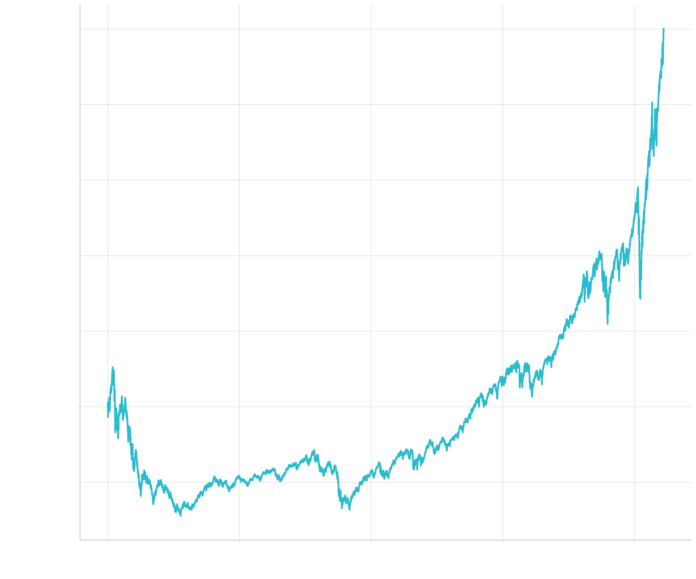

<!-- .slide: class="align-center" -->

<!-- .slide: data-state="no-toc-progress" --> <!-- don't show toc progress bar on this slide -->

# Digital Capital & Star Performers
<!-- .element: class="no-toc-progress" --> <!-- slide not in toc progress bar -->

<h2 style="text-align: center;">The returns to technological talent and investments in IT-related intangible capital</h2>

  

[Joschka Schwarz][1]

  

2020-02-11 | docsem | TU Hamburg

 <!-- .element: class="logo" -->

[1]: https://www.startupengineer.io/authors/schwarz/
<!-- [2]: https://www.tuhh.de/alt/sdw -->

----  ----

<!-- .slide: class="align-center" -->

# Motivation

----

<!-- .slide: class="align-top" -->

## Corporate Innovation & Entrepreneurship

----

<!-- .slide: class="align-top" -->

#### The five most valuable firms in the S&P 500 are all firms from the tech industry (with an especially rapid rise in this fraction in the last few years)

  

    <figure>
      
      <figcaption style="text-align: center;">NASDAQ</figcaption>
    </figure>
  

  

    <figure>
      
      <figcaption style="text-align: center;">Apple</figcaption>
    </figure>
  

----

<!-- .slide: class="align-top" -->

## Disentangling Autonomy

  

    
  

  

    
  

  

----

<!-- .slide: class="align-top" -->

#### Projects have various kinds of developers characterized by different types of development activities

  

    
<b>Reputation</b>

    

    
The expertise / performance of a developer depends on several factors:

    <ul style="font-size:28px">
      <li>Quality</li>
      <li>Continuity</li>
      <li>Quantity</li>
    </ul>
  

  

    
<b>Status</b>

    

    
The activity of users forms several kinds of social networks:

    <ul style="font-size:28px">
      <li>Network of collaboration</li>
      <li>Network of followers</li>
      <li>Network of watchers / stars</li>
    </ul>
  

  

        

        

  

  

  

  

----

<!-- .slide: class="align-center" -->

# Theory

----

<!-- .slide: class="align-top" -->

## Autonomy in Choosing Teams

    
test

    
test

    
test

    
test

----

<!-- .slide: class="align-top" -->

## Autonomy in Choosing Ideas

            

----

<!-- .slide: class="align-top" -->

## Autonomy in Choosing *Both* Teams and Ideas

 

#### Complements

* Exploration space of ideas & skills becomes larger

  (Hackmann, 2002)<!-- .element: class="reference" --> 

* "Collective ownership" around one's idea more likely to develop among familiar teammates

  (Gray et al., 2020)<!-- .element: class="reference" -->

#### Substitutes

* Self-selected teams lack cognitive diversity to elaborate novel ideas

  (Shin et al., 2012)<!-- .element: class="reference" --> 

* Self-selected teams and ideas as "quick wins" lead to confidence and complacency too early

  (Gist, 1987, Sitkin 1992, Lindsley et al., 1995, Knight et al., 2001, Goncalo et al., 2010, Rapp et al., 2014)<!-- .element: class="reference" --> 

 

> Hypothesis 3:
> The autonomy in choice of team and ideas are (a) complementary or (b) substitutes on entrepreneurial team performance.

----  ----

<!-- .slide: class="align-center" -->

# Methods

----

<!-- .slide: class="align-top" -->

## Experimental Setting

 

* 3 cohorts of GBWL students mastering the entrepreneurship project for 11 weeks
  * 937 students in 310 teams
* Procedure (pre-registered and approved by ethics board):
  1. Entry survey
  2. Course with treatments
  3. Exit survey
  4. External evaluation
* <!-- .element: class="fragment" -->"Natural field experiment": non-convenience task, subject not aware of experiment

  (Harrison and List, 2004)<!-- .element: class="reference" --> 

* <!-- .element: class="fragment" -->Students vs. employees (not seasoned entrepreneurs): results do not necessarily differ
  
  (Bolton et al., 2012, Frechette, 2016)<!-- .element: class="reference" -->

----

<!-- .slide: class="align-top" -->

## Experimental Treatments

 

* "Assign" conditions: random (instead of managerial)
  * good benchmark

    (Clement & Puranam, 2018)<!-- .element: class="reference" --> 
  
  * especially for novel tasks where managers lack knowledge about people's specific skills

    (Puranam et al., 2014)<!-- .element: class="reference" --> 

  * approximates reality 

    (Liu et al., 2016)<!-- .element: class="reference" --> 

* "Raw" quality of 15 __pre-defined__ ideas does not differ from __self-chosen__ ideas
  * Robustness check on "Mechanical turk"

----

<!-- .slide: class="align-top" -->

## Experimental Treatments
<!-- .element: class="no-toc-progress" -->

 

----

<!-- .slide: class="align-top" -->

## External Evaluation

 

* 40 external evaluators, who were practicing entrepreneurs, business angels, or venture capitalists
  * each evaluated 23.25 pitch decks on average => 3 evaluation per team
  * Criteria:

    (Maxwell, 2011; Dean et al., 2006)<!-- .element: class="reference" --> 

    * Novelty, Feasibility, Market potential, Success potential, Invitation probability
    * Investment: Evaluators could distribute 1 million among the projects they evaluated

----

<!-- .slide: class="align-top" -->

## Analysis

* Linear regression accounting for non-independence of repeated and cross-nested observations with respect to mentors, experts, evaluation order, and cohorts:

 
 

`$ y_{ij} = \beta_{0} + \beta_{1}*(Choose\;team)_i + \beta_{2}*(Choose\;idea)_i + \beta_{3}*(Choose\;both)_i + \gamma_{i} + \delta_{i} + \zeta_{ij} + \eta_{j} + \epsilon_{ij} $`

----  ----

<!-- .slide: class="align-center" -->

# Results

----

<!-- .slide: class="align-top" -->

## Main Results

 

----

<!-- .slide: class="align-top" -->

## Main Results
<!-- .element: class="no-toc-progress" -->

 

----

<!-- .slide: class="align-top" -->

## Kernel Densities and Quantile Regression

 

----

<!-- .slide: class="align-top" -->

## Channels of Mediation 

 

* Regression of intermediate outcomes on treatments:
  * Homophily
  * Prior ties
  * Team heterogeneity
  * Idea team fit
  * Collaboration quality

----

<!-- .slide: class="align-top" -->

## Causal Mediation Analysis

* Average Causal Mediation Effects (ACME)
  * control for pre-treatment variables to ensure sequential ignorability (conditional exogeneity of mediator)
  * quasi-Bayesian Monte Carlo method based on normal approximation with 1,000 simulations

    (Imai et al, 2010)<!-- .element: class="reference" --> 

 

 

* Larger direct effects: changes in unobserved inputs induced by the treatments (e.g. motivation, effort)

  (Heckman & Pinto, 2015)<!-- .element: class="reference" --> 
   

----

<!-- .slide: class="align-top" -->

## Overconfidence as Mechanim

----  ----

<!-- .slide: class="align-center" -->

# Conclusion

----

<!-- .slide: class="align-top" -->

## Conclusion

#### Contributions

* __Theoretical__:

  * Organizational design and microfoundations of autonomy

  * Autonomy and entrepreneurial (over-) confidence

 

* __Practical__:

  * Professionalization of (corporate) entrepreneurship

  * Understand the design and limits of current practices

#### Limitations & outlook

* Field experiment with real organization
  * Managerial assignment
  * Realistic degrees of freedom in choice
    * More or less contraint depending on organizational context (goals, structure) 

 

* Mechanism studies in more controlled environments

----  ----

<!-- .slide: class="align-center" -->

<!-- .slide: data-state="no-toc-progress" --> <!-- don't show toc progress bar on this slide -->

# *Thank You for Your attention!*
<!-- .element: class="no-toc-progress" -->

## *Let's keep in touch!*

  <ul class=network-icon aria-hidden=true>
    <li>
         <a href=https://www.startupengineer.io/authors/ihl/>
              <i class="fas fa-home big-icon" class="accent">: https://www.startupengineer.io/authors/ihl</i>
         </a>
    </li>
    <li>
         <a href=mailto:christoph.ihl@tuhh.de>
              <i class="fas fa-envelope big-icon" class="accent">: christoph.ihl@tuhh.de</i>
         </a>
    </li>
    <li>
        <a href=https://twitter.com/Ihluminate target=_blank rel=noopener>
              <i class="fab fa-twitter big-icon"class="accent">: @IHLuminate</i>
        </a>
    </li>
    <li>
        <a href=https://www.linkedin.com/in/christoph-ihl/ target=_blank rel=noopener>
              <i class="fab fa-linkedin big-icon" class="accent">: https://www.linkedin.com/in/christoph-ihl</i>
        </a>
    </li>
  </ul>

 <!-- .element: class="logo" -->

