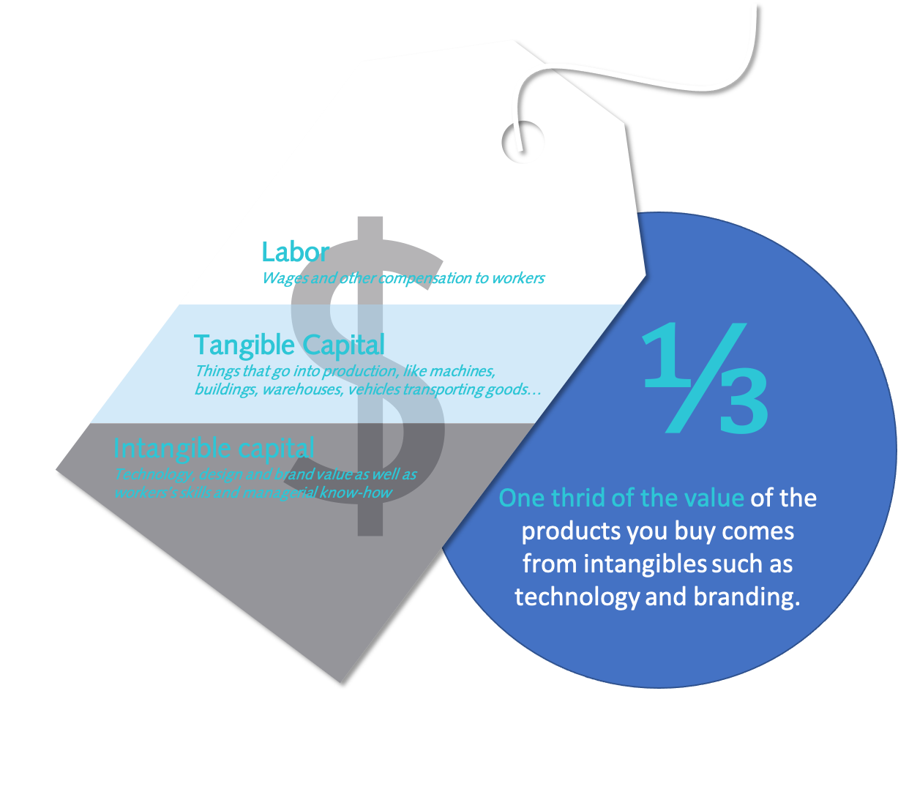

<!-- .slide: class="align-center" -->

<!-- .slide: data-state="no-toc-progress" --> <!-- don't show toc progress bar on this slide -->

# Digital Capital & Star Performers
<!-- .element: class="no-toc-progress" --> <!-- slide not in toc progress bar -->

<h2 style="text-align: center;">The returns to technological talent and investments in IT-related intangible capital</h2>

  

[Joschka Schwarz][1]

  

2020-02-11 | docsem | TU Hamburg

 <!-- .element: class="logo" -->

[1]: https://www.startupengineer.io/authors/schwarz/
<!-- [2]: https://www.tuhh.de/alt/sdw -->

----  ----

<!-- .slide: class="align-center" -->

# Motivation

----

<!-- .slide: class="align-top" -->

#### Test Page

        <!--- Box No. 1 (Left) --->
        

            

            

        

        <!--- Box No. 2 (Left) --->
        

            

              <ul class="square-list">
                <li>1</li>
                <li>2</li>
                <li>3</li>
              </ul>
            

        

        <!--- Space Holder Box --->
        
Three

----

<!-- .slide: class="align-top" -->

#### The five most valuable firms in the S&P 500 are all firms from the tech industry (with an especially rapid rise in this fraction in the last few years)

  

    

    

  

  

  

  

   <ul>
    <li>It’s become a truism that corporations must invest in <b>leading-edge digital technologies</b> to move ahead and outpace competitors.</li>
    <li>The five <b>most valuable firms</b> in the S&P 500 are all firms from the <b>tech industry</b> (with an especially rapid rise in this fraction in the last few years).</li>
    <li>As the economy becomes increasingly digitized, these assets can be expected to grow even further in importance.</li>
  </ul>
  

----

<!-- .slide: class="align-top" -->

#### Much of the rise in the concentration of power in these firms has been attributed to investments related to digital technologies

  

    

    

  

  

  

  

   <ul>
    <li>
      Superstar firms, unique in their capabilities to scale up innovations, have become increasingly important in the US economy.
      
(Autor et al., 2020; Hall, 2018; Van Reenen, 2018; De Loecker et al., 2020)

    </li>
    <li>The five <b>most valuable firms</b> in the S&P 500 are all firms from the <b>tech industry</b> (with an especially rapid rise in this fraction in the last few years).</li>
    <li>As the economy becomes increasingly digitized, these assets can be expected to grow even further in importance.</li>
    <li>Goal: Predict future firm-level productivity with digital capital accumulation</li>
  </ul>
  

----

<!-- .slide: class="align-top" -->

#### Digital laggards pay the consequences in lost revenue and customers

    
    <figcaption style="text-align:center;">Beiersdorf</figcaption>

----

<!-- .slide: class="align-top" -->

#### Intangible Assets

  

    

  

  

  

  <ul>
      <li>For digitally-focused firms, investments in non-tangible assets often account for significantly greater total costs than the technologies themselves</li>
    <li>New technologies such as AI and ML enable and require significant complementary investments, including business process redesign, co-invention of new products and business models, and <b>investments in human capital</b></li>
    <li>These assets comprise digital intangible capital</li>
    
Hall, 2001; Brynjolfsson et al., 2002

    <li>While these assets take time to build, the market value of firms should reflect the expected net present value of the cash flows they can generate in the future.</li>
  </ul>
  

----

<!-- .slide: class="align-top" -->

#### Can Engineers Boost Corporate Value? Accepted accounting principles often fail to capture the value of intangible capital

  

    ... and what about the value of the engineers and software talent driving these new technologies — can their value be measured, as well?
     
  

  
  

    Research Scope – The reason to study this topic is to ...
    

    <ul style="line-height:1;">
      <li>... measure intangible assets and capital (market value of knowledge / human capital)</li>
      <li>... examine how firms make and earn returns to investments in technology / 	technological labour</li>
      <li><s>... predict the economic effects of technologies</s></li>
    </ul>
  

  
  

  Research question
  

  <ul style="line-height:1;">
    <li>asd</li>
    <li>asd</li>
    <li>asd</li>
  </ul>
  

----

<!-- .slide: class="align-top" -->

#### Projects have various kinds of developers characterized by different types of development activities

  

    
<b>Reputation</b>

    

    
The expertise / performance of a developer depends on several factors:

    <ul style="font-size:28px; margin-left:50px;">
      <li>Quality</li>
      <li>Continuity</li>
      <li>Quantity</li>
    </ul>
  

  

    
<b>Status</b>

    

    
The activity of users forms several kinds of social networks:

    <ul style="font-size:28px">
      <li>Network of collaboration</li>
      <li>Network of followers</li>
      <li>Network of watchers / stars</li>
    </ul>
  

  

        

        

  

  

  

  

----

<!-- .slide: class="align-center" -->

# Theory

----

<!-- .slide: class="align-top" -->

## Box testing row

    

      

        

        

      

    

    

      

            

                        
                        <figcaption style="text-align:center;">Statistical Features</figcaption>
                        
                        <figcaption style="text-align:center;">Heuristic features</figcaption>
            

            

                          Data Extraction
            

      

    

    

          

            

                        
                        <figcaption style="text-align:center;">Classifier Learning</figcaption>
            

            

                          Learn LDA /
                          Run LDA
            

      

    

    

              

            

                        
                        <figcaption style="text-align:center;">Validation</figcaption>
            

            

                          Topics /
                          Manual Analysis
            

      

    

        

      

        
Categories
        

      

    

----

<!-- .slide: class="align-top" -->

## Autonomy in Choosing Ideas

            

----

<!-- .slide: class="align-top" -->

## Autonomy in Choosing *Both* Teams and Ideas

----  ----

<!-- .slide: class="align-center" -->

# Methods

----

<!-- .slide: class="align-top" -->

## Experimental Setting

 

* 3 cohorts of GBWL students mastering the entrepreneurship project for 11 weeks
  * 937 students in 310 teams
* Procedure (pre-registered and approved by ethics board):
  1. Entry survey
  2. Course with treatments
  3. Exit survey
  4. External evaluation
* <!-- .element: class="fragment" -->"Natural field experiment": non-convenience task, subject not aware of experiment

  (Harrison and List, 2004)<!-- .element: class="reference" --> 

* <!-- .element: class="fragment" -->Students vs. employees (not seasoned entrepreneurs): results do not necessarily differ
  
  (Bolton et al., 2012, Frechette, 2016)<!-- .element: class="reference" -->

----

<!-- .slide: class="align-top" -->

## Experimental Treatments

 

* "Assign" conditions: random (instead of managerial)
  * good benchmark

    (Clement & Puranam, 2018)<!-- .element: class="reference" --> 
  
  * especially for novel tasks where managers lack knowledge about people's specific skills

    (Puranam et al., 2014)<!-- .element: class="reference" --> 

  * approximates reality 

    (Liu et al., 2016)<!-- .element: class="reference" --> 

* "Raw" quality of 15 __pre-defined__ ideas does not differ from __self-chosen__ ideas
  * Robustness check on "Mechanical turk"

----

<!-- .slide: class="align-top" -->

## Experimental Treatments
<!-- .element: class="no-toc-progress" -->

 

----

<!-- .slide: class="align-top" -->

## External Evaluation

 

* 40 external evaluators, who were practicing entrepreneurs, business angels, or venture capitalists
  * each evaluated 23.25 pitch decks on average => 3 evaluation per team
  * Criteria:

    (Maxwell, 2011; Dean et al., 2006)<!-- .element: class="reference" --> 

    * Novelty, Feasibility, Market potential, Success potential, Invitation probability
    * Investment: Evaluators could distribute 1 million among the projects they evaluated

----

<!-- .slide: class="align-top" -->

## Analysis

* Linear regression accounting for non-independence of repeated and cross-nested observations with respect to mentors, experts, evaluation order, and cohorts:

 
 

`$ y_{ij} = \beta_{0} + \beta_{1}*(Choose\;team)_i + \beta_{2}*(Choose\;idea)_i + \beta_{3}*(Choose\;both)_i + \gamma_{i} + \delta_{i} + \zeta_{ij} + \eta_{j} + \epsilon_{ij} $`

----  ----

<!-- .slide: class="align-center" -->

# Results

----

<!-- .slide: class="align-top" -->

## Main Results

 

----

<!-- .slide: class="align-top" -->

## Main Results
<!-- .element: class="no-toc-progress" -->

 

----

<!-- .slide: class="align-top" -->

## Kernel Densities and Quantile Regression

 

----

<!-- .slide: class="align-top" -->

## Channels of Mediation 

 

* Regression of intermediate outcomes on treatments:
  * Homophily
  * Prior ties
  * Team heterogeneity
  * Idea team fit
  * Collaboration quality

----

<!-- .slide: class="align-top" -->

## Causal Mediation Analysis

* Average Causal Mediation Effects (ACME)
  * control for pre-treatment variables to ensure sequential ignorability (conditional exogeneity of mediator)
  * quasi-Bayesian Monte Carlo method based on normal approximation with 1,000 simulations

    (Imai et al, 2010)<!-- .element: class="reference" --> 

 

 

* Larger direct effects: changes in unobserved inputs induced by the treatments (e.g. motivation, effort)

  (Heckman & Pinto, 2015)<!-- .element: class="reference" --> 
   

----

<!-- .slide: class="align-top" -->

## Overconfidence as Mechanim

----  ----

<!-- .slide: class="align-center" -->

# Conclusion

----

<!-- .slide: class="align-top" -->

## Conclusion

#### Contributions

* __Theoretical__:

  * Organizational design and microfoundations of autonomy

  * Autonomy and entrepreneurial (over-) confidence

 

* __Practical__:

  * Professionalization of (corporate) entrepreneurship

  * Understand the design and limits of current practices

#### Limitations & outlook

* Field experiment with real organization
  * Managerial assignment
  * Realistic degrees of freedom in choice
    * More or less contraint depending on organizational context (goals, structure) 

 

* Mechanism studies in more controlled environments

----  ----

<!-- .slide: class="align-center" -->

<!-- .slide: data-state="no-toc-progress" --> <!-- don't show toc progress bar on this slide -->

# *Thank You for Your attention!*
<!-- .element: class="no-toc-progress" -->

## *Let's keep in touch!*

  <ul class=network-icon aria-hidden=true>
    <li>
         <a href=https://www.startupengineer.io/authors/ihl/>
              <i class="fas fa-home big-icon" class="accent">: https://www.startupengineer.io/authors/ihl</i>
         </a>
    </li>
    <li>
         <a href=mailto:christoph.ihl@tuhh.de>
              <i class="fas fa-envelope big-icon" class="accent">: christoph.ihl@tuhh.de</i>
         </a>
    </li>
    <li>
        <a href=https://twitter.com/Ihluminate target=_blank rel=noopener>
              <i class="fab fa-twitter big-icon"class="accent">: @IHLuminate</i>
        </a>
    </li>
    <li>
        <a href=https://www.linkedin.com/in/christoph-ihl/ target=_blank rel=noopener>
              <i class="fab fa-linkedin big-icon" class="accent">: https://www.linkedin.com/in/christoph-ihl</i>
        </a>
    </li>
  </ul>

 <!-- .element: class="logo" -->

